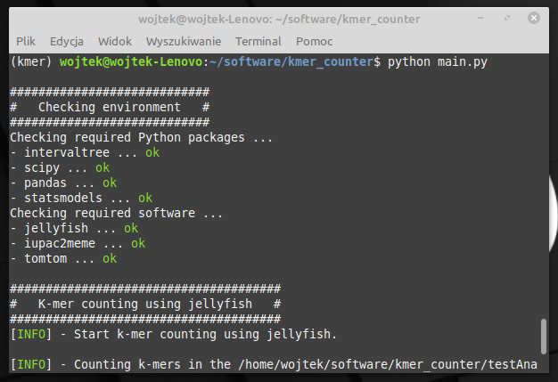
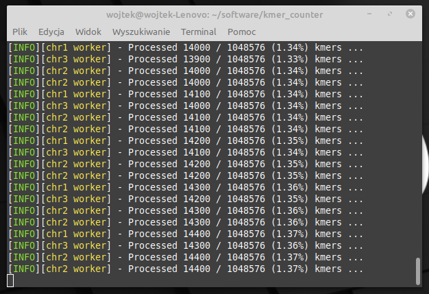

# K-mer counter
The tool was developed for the identification of k-mers specific to Miniature Inverted-repeat Transposable Elements (MITEs) being a part of sequences recognized by transcription factors (TF).

## Screenshots




## Analysis stages:

1.  K-mer identification
    

The first stage of analysis is the identification of all k-mers using Jellyfish. The analysis is performed for each chromosome individually. The size of k-mers can be specified within the configuration file.

2.  K-mer counting
    

Next, the software counts the number of occurrences of each k-mer within MITE sequences and outside of them.

Every MITE position is stored in the interval tree data structure which significantly speeds up the searching process. Additionally, the search is performed for each chromosome by a single thread. You can speed up the search process by specifying the number of available threads in the configuration file.

The counting results for each chromosome are stored in a single, tab-delimited text file. Each row represents a specific k-mer, while columns correspond to individual MITEs. Data from all tables are next merged into a single file.

3.  Statistical analysis
    
The data contained in the summary table are subjected to statistical analysis to identify the k-mers with a significantly increased representation in mobile genetic elements of the MITE type. For this purpose, the Fisher’s exact test was used. Obtained *p* values are corrected using the *Bonferroni* method.

4.  Identification of motifs recognized by TF
    
Identified k-mers, which representation is significantly higher in MITE elements than in other parts of the genome, are subjected to analysis using *TomTom* software to identify k-mers that are part of sequences recognized by transcription factors.

# Environment preparation

## Install miniconda
You can download the latest version of the miniconda from [https://docs.conda.io/en/latest/miniconda.html](https://docs.conda.io/en/latest/miniconda.html). After installation, create a new conda environment using the below command:

```

conda create -n <environment-name> python=3.7

```
To enter the newly created environment run the command:
```

conda activate <environment-name>

```

## Install required software using conda

### Install jellyfish

Jellyfish is a k-mer counter based on a multi-threaded hash table implementation.

```

conda install -c bioconda jellyfish

```

### Install MEME Suit

[MEME Suit](http://web.mit.edu/meme_v4.11.4/share/doc/overview.html) - Motif-based sequence analysis tools. Kmer-counter uses two tools from this tools set:

*  [iupac2meme](http://web.mit.edu/meme_v4.11.4/share/doc/iupac2meme.html) - converts an IUPAC string (in this case DNA sequences) to MEME format.

*  [tomtom](http://web.mit.edu/meme_v4.11.4/share/doc/tomtom.html) - compares one or more motifs (in MEME format) against a database of known motifs (e.g., JASPAR) (also in MEME format). Below you can find links to some motifs databases:

*  [meme](https://meme-suite.org/meme/db/motifs)

*  [JASPAR](http://jaspar2018.genereg.net/downloads/)

> The motif database should be represented as a **single** batch file which localisation must be provided in the ***config.txt*** file.

  

To install the MEME Suit write the following command:

  

```

conda install -c bioconda meme

```

## Install Python modules

To install all required Python modules just run below command:

```

pip install -r requirements.txt

```

The *requirements.txt* file is provided together with the Kmer-counter. Below are listed all required Python modules:

* certifi

* intervaltree

* numpy

* pandas

* patsy

* python-dateutil

* pytz

* scipy

* six

* sortedcontainers

* statsmodels

## Run analysis

To start the analysis execute below command:

```

python main.py

```